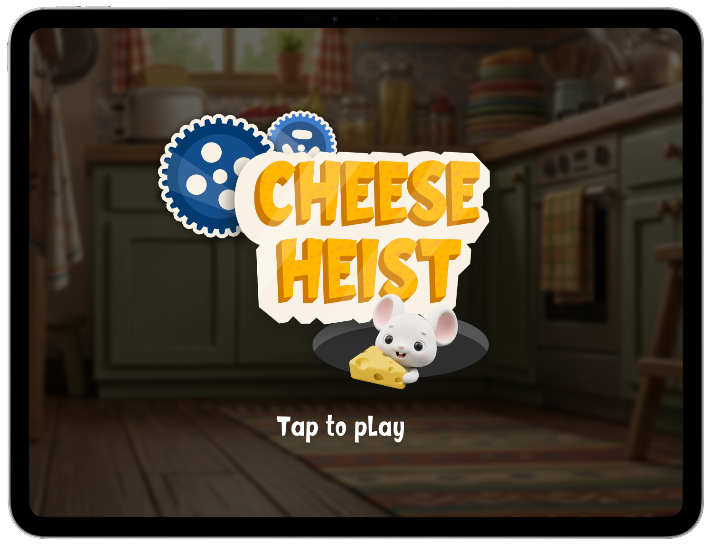
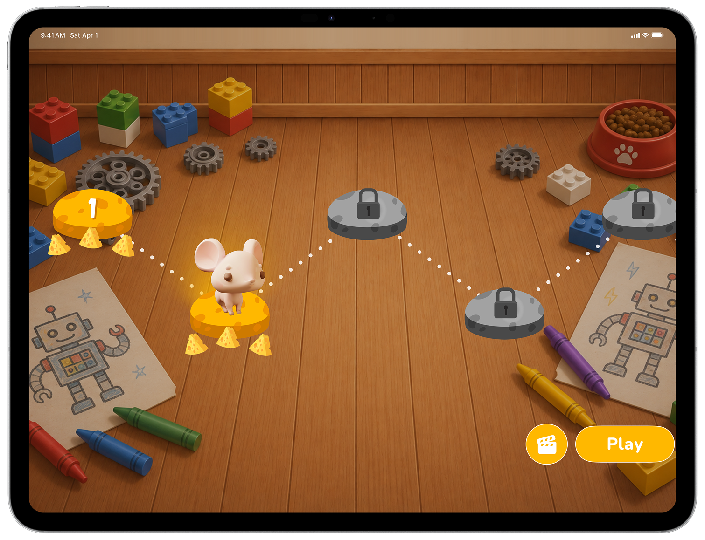
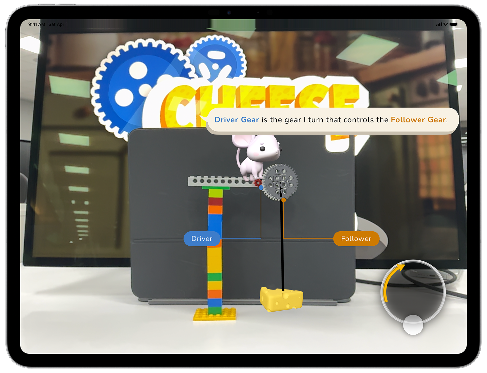
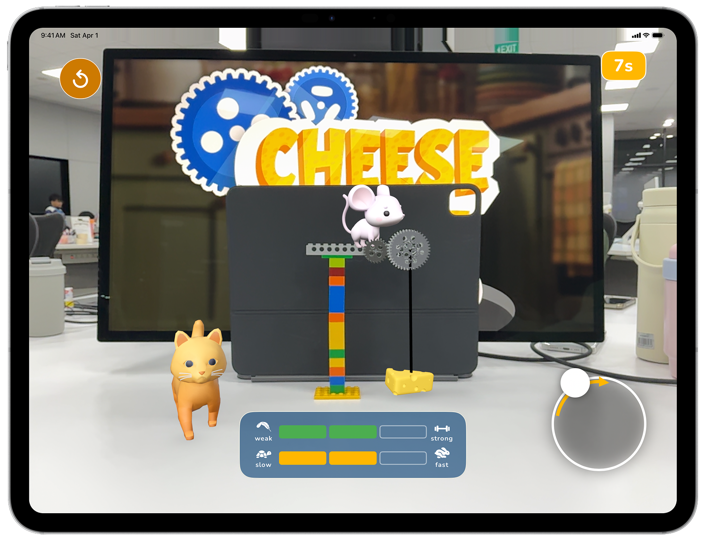
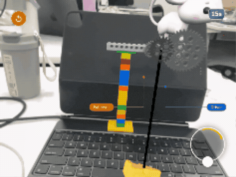
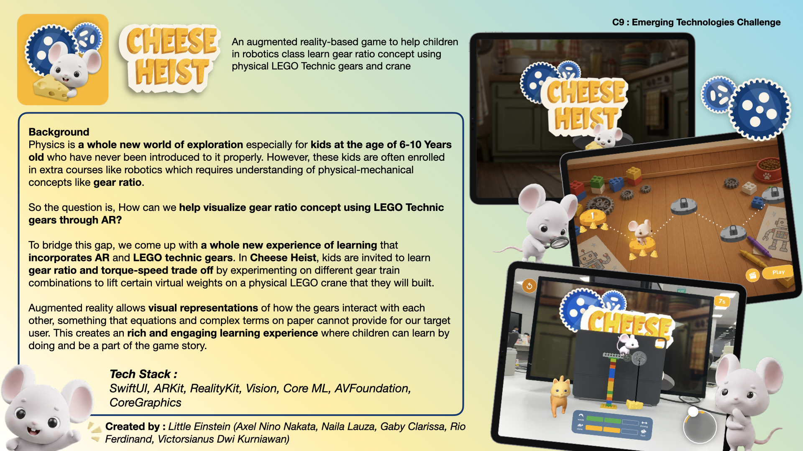

<div align="center">

# 🧀 Cheese Heist

**An augmented reality game that teaches gear ratio to 6–10 year olds — by letting them build it in LEGO first.**

*SwiftUI · RealityKit · ARKit · Vision · Core ML — iPadOS, LiDAR only*



</div>

---

## The idea in one sentence

A mouse needs to steal a wedge of cheese. The only way up is a crane the child
builds themselves out of LEGO Technic gears — and the *combination of gears
they choose* decides whether that crane lifts the cheese fast and weak, or
slow and strong. Nothing is explained with numbers. Everything is felt.

## Why

Gear ratio is usually the first place a robotics class loses a 7-year-old.
The formula (`ratio = teeth_follower / teeth_driver`) needs division they
don't have yet, and a hand-cranked LEGO build alone doesn't create enough of
a felt difference between gear choices to teach anything.

**Cheese Heist's answer:** point an iPad at the LEGO crane the child just
built, and overlay a physics-accurate virtual transmission on top of it in
real time. The child never sees a ratio. They see the rope pull the cheese up
*fast and weak*, or *slow and strong* — and they chose which, by choosing
where the mouse stands.

No formulas. No units. One affordance per screen. Every idea taught by doing,
never by being told.

---

## Walking through the app

### 1 · Splash

Full-bleed kitchen scene, a breathing logo, and one instruction: tap to play.
The whole screen is the tap target — there is no menu to get lost in yet.

### 2 · The world comes alive

<div align="center">

</div>

The very first thing the app does after finding a table is **anchor the
story to it.** LiDAR scans the surface, the child taps a green ring, and
from that point on the mouse, the cat, and the cheese live in *their* room —
survive the iPad turning away and coming back, survive being carried across
the table. A short narrated cutscene introduces the antagonist (the cat),
the objective (the cheese), and the actor (the mouse) — entirely inside the
child's own physical space, not on a cutaway screen.

### 3 · Build the crane

Before any AR happens, the child follows an in-app blueprint — three steps,
image + one short line of text each — to physically build a LEGO Technic
crane: a tower, an arm, and a meshed pair of gears from the 8T / 24T / 40T
set. The blueprint is a contract: detection downstream assumes this exact
geometry, so the child is never guessing what to build.

### 4 · Choose a level

<div align="center">

</div>

Progress is a trail of cheese the mouse hops across — no lists, no numbers,
no percentages. Levels unlock left to right as the child completes them.

### 5 · Meet the gears

<div align="center">

</div>

This is the core trick of the product. A Core ML model (YOLOv11, trained on
the three gear types) finds the child's *actual physical gears* through the
camera, and a virtual twin locks on top of each one — same size, same
position, spinning in sync. The app labels them **Driver** (blue — the gear
the mouse stands on and turns) and **Follower** (amber — the gear that turns
because the driver does), and lets the child tap to choose which is which.
Two gears turning in opposite directions is the whole lesson at this stage —
no vocabulary needed before the child has already seen it happen.

### 6 · Crank, lift, learn

<div align="center">

</div>

A circular joystick is the crank. The moment the child cranks clockwise, the
rope starts winding on the follower gear's axle and the cheese lifts —
at a speed and a strength that come entirely from *which gear pair they
built with*, read live off a **weak↔strong / slow↔fast** meter. Swap which
gear is the driver, and the same crank motion produces a visibly different
lift. That felt difference — never stated as a number, always *shown* — is
the entire teaching mechanism.

<div align="center">

</div>

The cat wanders nearby the whole time, oblivious, closing the loop back into
the story the cutscene opened.

---

## One-pager

<div align="center">

</div>

---

## How it's actually built

Cheese Heist runs the whole physics simulation for real — SI units,
deterministic, unit-tested — and shows the child none of it.

- **Vision pipeline:** ARKit's LiDAR depth stream feeds a YOLOv11 Core ML
  model that classifies each physical gear (8T / 24T / 40T) from the camera
  feed; a scene-depth lookup turns its 2D bounding box into an exact 3D
  world position for the virtual twin to lock onto.
- **Gear physics:** a real transmission model — ratio, torque, an actual
  torque/speed curve for the mouse's "muscle" (the same equation a DC motor
  obeys), rope winding kinematics — computed every frame in `Core/Gear/`,
  shared by every level.
- **AR scene graph:** RealityKit, one world anchor per session, occlusion-
  aware so the mouse can stand convincingly behind a real LEGO brick.
- **UI:** SwiftUI throughout, MVVM with `@Observable`, a small hand-rolled
  design system (zero hardcoded colors, fonts, or spacing anywhere in the
  view layer) so every screen reads as one consistent, hand-illustrated
  world.

### Tech stack

| Layer | Technology |
|---|---|
| UI | SwiftUI, `@Observable` MVVM |
| Augmented Reality | ARKit, RealityKit (LiDAR scene depth + mesh occlusion) |
| Computer vision | Vision + Core ML (YOLOv11n, custom-trained on LEGO Technic gears) |
| Physics | Hand-built deterministic gear-train / actuator simulation |
| Audio | AVFoundation |
| Graphics | CoreGraphics |
| Platform | iPadOS 18+, iPad Pro with LiDAR (hard requirement — see below) |

### Why LiDAR is non-negotiable

Cheese Heist hard-blocks on any device without a LiDAR sensor rather than
shipping a degraded fallback. Three things depend on it directly: fast plane
detection on a plain classroom table, depth-accurate 2D→3D projection of
every gear the vision model finds, and believable occlusion between virtual
characters and real LEGO. None of those degrade gracefully — they either
work convincingly or the illusion breaks, so the app checks capability once
at launch and routes unsupported hardware to a clear terminal screen instead
of guessing.

### Architecture at a glance

```
App/            composition root — owns the AR session, routes, and the app-wide state machine
Commons/        design system tokens + shared UI components (no view has a magic number)
Core/           AR session, Vision pipeline, gear physics, entities — level-agnostic, reused everywhere
Features/       Splash, Cutscene, Blueprint, Gameplay (Level 1, 2), Result — composition only, no logic
```

Two rules keep this honest: **"could a future level want this unchanged?"**
sends it to `Core/`; **views compose, they never draw** — any `Shape` or
custom drawing lives in `Commons/Components/`. File and function size are a
CI-enforced budget, not a style guide.

---

## Team

<div align="center">

### 🐭 Little Einstein

**Axel Nino Nakata** · **Naila Lauza** · **Gaby Clarissa** · **Rio Ferdinand** · **Victorsianus Dwi Kurniawan**

*Built for an emerging-technologies exhibition, exploring how augmented reality can make an
invisible mechanical concept visible, tangible, and fun for kids who haven't met a formula yet.*

</div>

---

<div align="center">
<sub>🧀 Cheese Heist — teaching gear ratio without ever saying the word "ratio."</sub>
</div>
